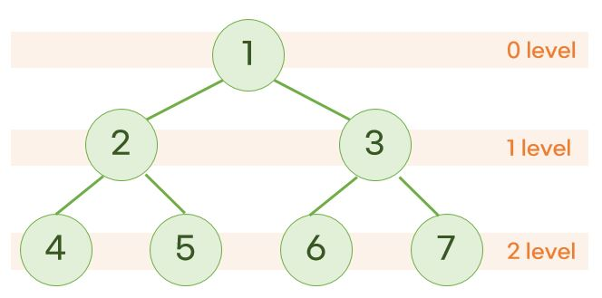

# BFS (넓이우선탐색)

 <br>

- 레벨별로 탐색
- 특정 노드와 연결된 노드들을 큐에 추가하고, 방문하면 pop을 함
- BFS는 DFS와 달리 상태트리에서 많이 쓰임
- 출발 지점에서 도착 지점으로 가는 최단거리를 구할 때 많이 사용함

# [python]

## 트리의 탐색 방법 - bfs

- queue를 이용해서 푼다.

```py
def bfs(root):
    # 초기 세팅
    visited = [] # 방명록
    if root is None: # 트리가 없다는 뜻
        return [];

    q = deque() # 방문 예약지
    q.append(root)

    # q가 비어있을 때까지 반복한다. (bfs 시작)
    while q:
        nowNode = q.popleft() # queue의 맨 앞 노드를 pop한다. nowNode를 통해 접근한다.
        visited.append(nowNode.value) # 방문 표시

        if nowNode.left:
            q.append(nowNode.left)
        if nowNode.right:
            q.append(nowNode.right)
    return visited

print(bfs(root))
```

## 그래프의 탐색 방법 - bfs

- 인접 리스트와 그래프를 탐색하는 방법이다.

```py
graph = {
    'A': ['B', 'D', 'E'],
    'B': ['A', 'C', 'D'],
    'C': ['B'],
    'D': ['A', 'B'],
    'E': ['A']
}

from collections import deque

def bfs(graph, start_v):
    visited = [start_v]
    queue = deque(start_v) # 시작 노드를 queue에 넣고 시작한다.

    while queue:
        now_v = queue.popleft()
        for v in graph[now_v]:
            if v not in visited:
                visitied.append(v)
                queue.append(v) # 나중에 들릴게~
    return visited

bfs(graph, 'A')
```

### 1) 섬 갯수 카운트하기 - bfs

```py
from collections import deque

def numIslands(grid):
    answer = 0
    m = len(grid) # 4
    n = len(grid[0]) # 5
    visited = [[False] * n for _ in range(m)]
    dx = [-1, 1, 0, 0] # 상, 하, 좌, 우
    dy = [0, 0, -1, 1]

    def bfs(x, y):
        visited[x][y] = True # 방문 표시
        q = deque((x, y))

        while q:
            nowX, nowY = q.popleft()
            for k in range(4):
                nextX = nowX + dx[k]
                nextY = nowY + dy[k]

                if (nextX >= 0 and nextX < m) and (nextY >= 0 and nextY < n): # 0~m, 0~n이내에 있고
                    if grid[nextX][nextY] == 1 and not visited[nextX][nextY]: # 섬이고 아직 방문하지 않았다면
                        visited[nextX][nextY] = True
                        q.append((nextX, nextY))

    for i in range(m):
        for j in range(n):
            if grid[i][j] == 1 and not visited[i][j]:
                bfs(i, j)
                answer += 1
    return answer

print(numIslands(grid = [
    [1, 1, 0, 0, 0],
    [1, 1, 0, 0, 0],
    [0, 0, 1, 0, 0],
    [0, 0, 0, 1, 1]
]))
```

### 2) 최단거리 구하기 - bfs

```py
from collections import deque

def shortestPath(grid):
    answer = -1
    row = len(grid)
    col = len(grid[0])

    if grid[0][0] != 0 or grid[row - 1][col - 1] != 0:
        return -1

    dx = [1, -1, 0, 0, 1, 1, -1, -1] # 상하좌우대각선
    dy = [0, 0, 1, -1, 1, -1, 1, -1]
    visited = [[False] * col for _ in range(row)]

    q = deque() # ⭐ 튜플은 선언할 때 바로 초기화 하면 안된다.
    q.append((0, 0, 1)) # (0, 0)에 방문했을 때 길이는 1이다.
    visited[0][0] = True

    while q:
        nowR, nowC, nowLength = q.popleft()
        # 목적지에 도착했을 때 nowLength를 answer에 저장한다.
        if nowR == row - 1 and nowC == col - 1:
            answer = nowLength
            break

        # 현재 node에 연결되어있는 모든 node를 방문 예약을 한다.
        for k in range(8):
            nextR = nowR + dx[k]
            nextC = nowC + dy[k]

            if (nextR >= 0 and nextR < row) and nextC >= 0 and nextC < col:
                if grid[nextR][nextC] == 0 and not visited[nextR][nextC]: # 아직 방문하지 않았다면
                    q.append((nextR, nextC, nowLength + 1))
                    visited[nextR][nextC] = True

    return answer

print(shortestPath(grid = [
    [0, 0, 0, 1, 0, 0, 0],
    [0, 1, 1, 1, 0, 1, 0],
    [0, 1, 0, 0, 0, 1, 0],
    [0, 0, 0, 1, 1, 1, 0],
    [0, 1, 0, 0, 0, 0, 0]
]))
```

### 3 ) 열 수 없는 방이 있는가? - bfs

```py
from collections import deque

def canOpenRooms(rooms):
  visited = [False] * len(rooms)

  # v에 연결되어있는 모든 vertex에 방문한다.
  def bfs(v):
    q = deque()
    q.append(v)
    visited[v] = True

    while q:
        nowV = q.popleft()

        for nextV in rooms[nowV]:
            if visited[nextV] == False:
                q.append(nextV)
                visited[nextV] = True

  bfs(0)


rooms = [[1, 3], [2, 4], [0], [4], [], [3, 4]]
print(canOpenRooms(rooms))
```
