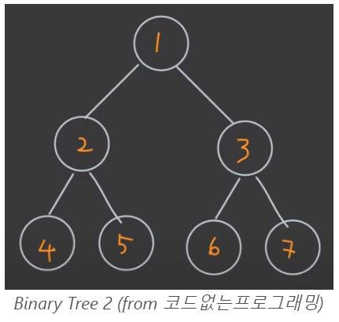

# 그래프와 트리

### 그래프

- 노드들과 노드들 사이를 연결하는 간선으로 구성된 것이다.
- 그래프는 하나의 root node가 있고, 각 노드에 child node가 연결되어 있다.

### 트리

- 그래프의 일종이나 cycle이 없고 서로 다른 두 노드를 잇는 길이 하나뿐인 그래프를 의미한다.
- 노드가 n개인 트리는 항상 n-1개의 간선을 가진다.

# 이진 트리

- child의 개수가 2개로 제한된 트리를 '이진 트리'라고 한다.
- 이진 트리는 각 노드의 자식 수에 따라 3가지로 나뉜다.
  - Full Binary Tree
  - Complete Binary Tree
  - Perfect Binary Tree

## 이진트리를 순회하는 법

1. 깊이 우선 탐색
   - 전위 순회 (Pre-order)
   - 중위 순회 (In-order)
   - 후위 순회 (Post-order)
2. 너비 우선 탐색
   - 레벨 순회 (Level-order)

### ex01

(L) - (N) - (R)
=> N이 루트 노드일 때

- Pre-order: NLR
- In-order: LRN
- Post-order: LRN
- Level-order: NLR

### ex02

 <br>

- Pre-order: 1234567
- In-order: 4251637
- Post-order: 4526731
- Level-order: 1234567

cf.[참고](https://doheelab.github.io/algorithm/binary_tree/)

# [python]

## Binary Tree 구현

```py
class Node:
   def __init__(self):
      self.value = 0
      self.left = None
      self.right = None

class BinaryTree:
   def __init__(self):
      self.root = None


bt = BinaryTree()
bt.root = Node(value = 1)
bt.root.left = Node(value = 2)
bt.root.right = Node(value = 3)
bt.root.left.left = Node(value = 4)
bt.root.left.right = Node(value = 5)
bt.root.right.right = Node(value = 6)
```

## 두 노드의 가장 낮은 공통 조상 구하기

- postOrder 방식으로 순회하는 것과 같다.
- left, right를 먼저 방문을하고, 그 결괏값을 토대로 root를 방문하기 때문이다.

```py
def LCA(root, p, q):
   if root = None:
      return None

   letf = LCA(root.left, p, q)
   right = LCA(root.right, p, q)

   if root == p or root == q: # root가 p이거나 q이면
      return root
   elif left and right: # left와 right가 둘다 있다면 (=> root를 반환)
      return root
   return left or right # left도 None, right도 None이면 None을 반환

```

## 이진트리의 최대 깊이 구하기

- level order로 해당 문제를 해결할 수 있다.
- O(n)

```py
from collections import deque

def maxDepth(node):
   maxDepth = 0
   if root is None: # root 노드가 없으면 깊이는 0이다.
      return maxDepth

   q = deque() # queue만들기
   q.append((node, depth))

   while q:
      nowNode, nowDepth = q.popleft()
      maxDepth = max(maxDepth, nowDepth)
      if nowNode.left:
         q.append((nowNode, nowDepth + 1))
      if nowNode.right:
         q.append((nowNode, nowDepth + 1))

   return maxDepth

root = [3, 9, 21, None, None, 17, 4]

# 트리 구성하는법
class TreeNode:
   def __init__(self, l - None, r = None, v):
      self.left = l
      self.right = r
      self.value = v

root = TreeNode(v = 3)
root.left = TreeNode(v = 9)
root.right = TreeNode(v = 21)
root.right.left = TreeNode(v = 17)
root.right.right = TreeNode(v = 4)

print(maxDepth(root))
```
