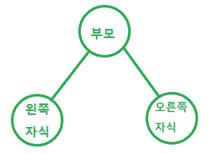
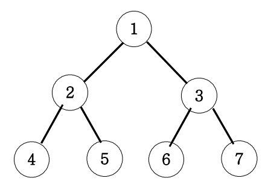

# 이진트리
## 기본구조
;

## 트리
- 트리의 순회 방법은 총 3가지가 있다. 아래의 그림으로 순회 방법을 알아보자.

;

### 1. 전위순회
- 탐색순서: (부모) → (왼쪽) → (오른쪽)
- 1 → 2 → 4 → 5 → 3 → 6 → 7
```js
function solution(v) {
    let answer;
    function dfs(v) {
        if(v > 7) {
            return;
        } else {
            console.log(v); // 이 지점에서 부모를 출력하면 전위순회
            dfs(v*2); // 왼쪽자식으로 넘어감
            dfs(v*2+1); // 오른쪽자식으로 넘어감
        }
    }
    dfs(v);
    return answer;
}

console.log(solution(1)); // v는 부모 노드를 의미함 (넘어온 건 부모)

```

### 2. 중위순회
- 탐색순서: (왼쪽) → (부모) → (오른쪽)
- 4 → 2 → 5 → 1 → 6 → 3 → 7
```js
function dfs(v) {
    if(v > 7) {
        return;
    } else {
        dfs(v*2);
        console.log(v); // 이 지점에서 부모를 출력하면 중위순회
        dfs(v*2+1);
    }
}
```

### 3. 후위순회
- 탐색순서: (왼쪽) → (오른쪽) → (부모)
- 4 → 5 → 2 → 6 → 7 → 3 → 1
```js
function dfs(v) {
    if(v > 7) {
        return;
    } else {
        dfs(v*2);
        dfs(v*2+1);
        console.log(v); // 이 지점에서 부모를 출력하면 후위순회
    }
}
```