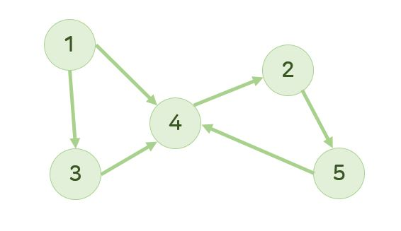
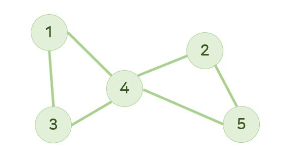
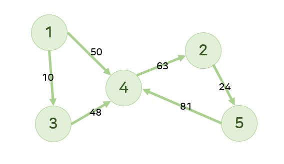

# Graph (그래프)

- 노드(정점)와 엣지(간선)으로 이루어진 자료구조
- 루트 노드가 없는 트리처럼 보이며, 트리보다 현실 세계에 존재한느 연결 관계를 더 잘 표현한다.
  - **edge**로 연결된 정점들은 서로 **인접한 상태**이다.

## 방향 그래프

- 방향성이 있는 간선으로 구성된 그래프로, Digraph라고도 부른다.

  

- 모든 경로의 가지수
  - (1, 4), (1, 3), (2, 5), (3, 4), (4, 2), (5, 4)

## 무방향 그래프

- 방향성이 없는 간선으로 구성된 그래프
  - 노드 양쪽으로 이동 가능하다.

  

- 모든 경로의 가지수
  - (1, 4), (4, 1), (1, 3), (3, 1), (2, 5), (5, 2), (3, 4), (4, 3), (4, 2), (2, 4). (5, 4), (4, 5)

## 가중치 그래프

- 각각의 간선이 가중치를 가진 그래프
  - 방향 가중치, 무방향 가중치 그래프가 있다.

  
  

# 그래프 탐색(순회) 방법

- 그래프 탐색 방법은 트리의 탐색 방법과 같이 2개의 방법으로 나뉜다.
  - BFS
  - DFS
