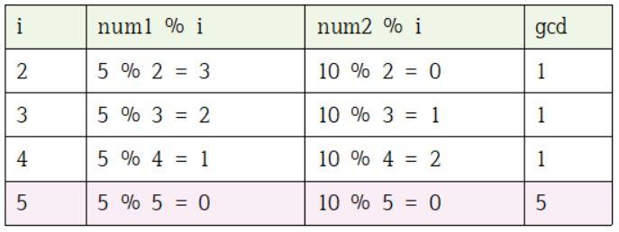
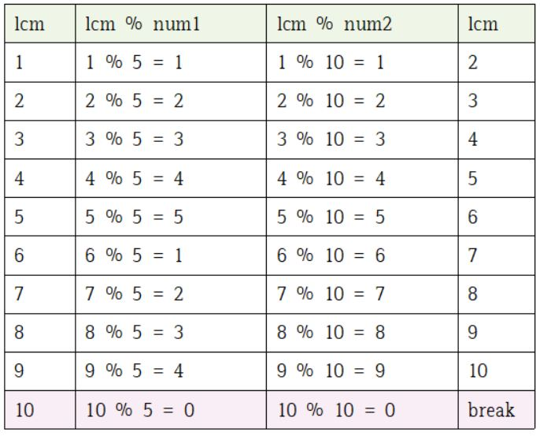

> 수학관련 내용 정리!

# 두 수의 최대공약수 구하기
- 최대공약수는 num1, num2의 **공통된 약수** 중 **가장 큰 정수**를 의미함
- 2부터 Math.min(num1, num2)까지 모든 정수로 나눠보면 됨

## 코드
```js
function getGreatestCommonDivisor(num1, num2) {
    let gcd = 1;
    for(let i = 2; i <= Math.min(num1, num2); i++) {
        if(num1%i === 0 && num2&i ===0) gcd = i;
    }
    return gcd;
}

getGreatestCommonDivisor(5, 10);
```

## 풀이
 <br>


# 두 수의 최소공배수 구하기
- 최소공배수는 num1과 num2의 **공통인 배수** 중 **가장 작은 수**를 의미함
- lcm을 1부터 시작하여 lcm++을 하면서 num1과 num2로 lcm으로 나눴을 때, 나머지 값이 0인지 확인해보기

## 코드
```js
function getLeastCommonMultiple(num1, num2) {
    let lcm = 1;
    whlie(1) {
        if((lcm%num1 === 0) || (lcm%num2 === 0)) break;
        lcm++;
    }
    return lcm;
}

getLeastCommonMultiple(5, 10);
```

## 풀이

